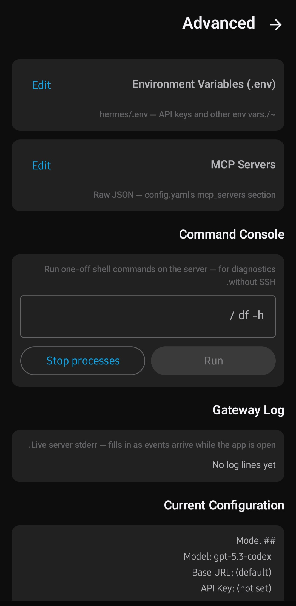
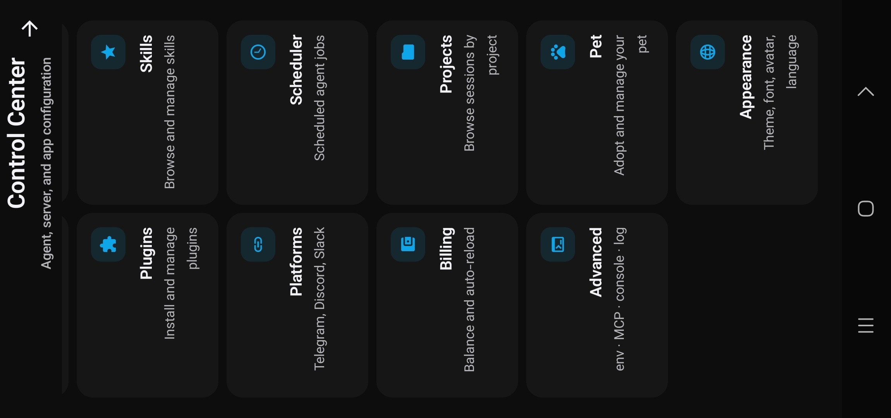
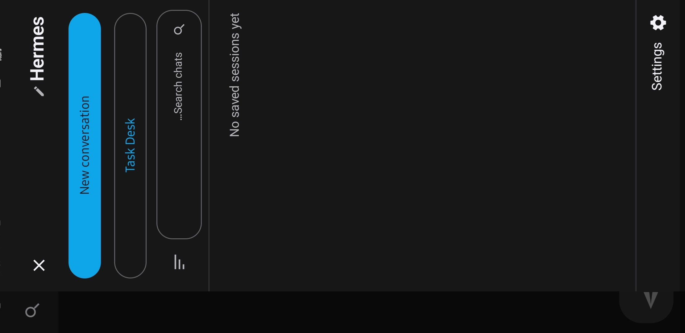
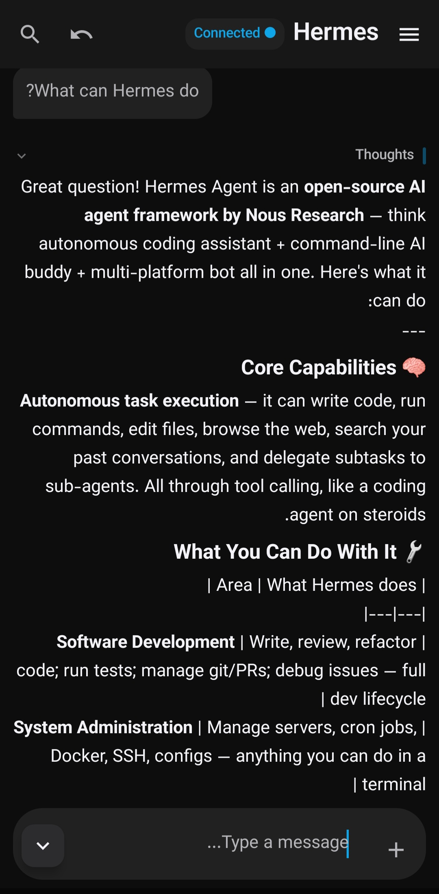

<p align="center">
  
  <br><br>
  <b>یک کلاینت نیتیو اندروید برای Hermes Agent خودت 🤖📱</b>
  <br>
  <sub>این اپ هوش مصنوعی رو روی گوشی اجرا نمی‌کنه — به gateway‌ای که روی سرور/VPS خودت داری وصل می‌شه.</sub>
  <br><br>
  <a href="https://github.com/traveler3022/Hermes-Pocket/actions/workflows/build-apk.yml"></a>
  <a href="https://github.com/traveler3022/Hermes-Pocket/releases/latest"></a>
  <a href="LICENSE"></a>
  <br><br>
  <a href="README.md">English</a> · فارسی
</p>

<div dir="rtl">

---

## درباره

**[Hermes Agent](https://github.com/NousResearch/hermes_agent)** یه ایجنت هوش مصنوعی متن‌باز از [Nous Research](https://nousresearch.com) که روی سرور یا VPS خودت اجرا می‌شه. می‌تونه دستورات شل رو اجرا کنه، فایل ویرایش کنه، تو وب بگرده و API صدا بزنه.

**Hermes Pocket کلاینت اندروید اونه.** یه اپ Jetpack Compose نیتیو که از طریق WebSocket امن به gateway هرمس وصل می‌شه. هیچ هوش مصنوعی روی گوشی اجرا نمی‌شه — صرفاً یه کلاینت از راه دور.

| بخش | نقش | محل اجرا |
|---|---|---|
| 🧠 **Hermes Agent** | ایجنت هوش مصنوعی | سرور/VPS خودت، پشت TLS proxy |
| 📱 **Hermes Pocket** | کلاینت چت اندروید | گوشی تو، از طریق Wi-Fi یا دیتا |

> [!IMPORTANT]
> قبل از استفاده باید یه سرور Hermes Agent در حال اجرا داشته باشی. [Hermes Agent](https://github.com/NousResearch/hermes_agent) برای راه‌اندازی سرور.

---

## اسکرین‌شات‌ها

<div align="center">
  
  
  
  <br>
  
  
  
</div>

---

## قابلیت‌ها

### 💬 تجربهٔ چت
- **پاسخ‌های استریم‌شونده** — کلمه‌به‌کلمه، با سؤال کاربر در بالای ویوپورت (الگوی Gemini/ChatGPT موبایل) و پاسخ در فضای خالی پایین استریم می‌شه
- **نمایش استدلال** — بلوک تفکر جمع‌شدنی با نشانگرهای زندهٔ احساسی که ایجنت ارسال می‌کنه
- **سوییچ سطح استدلال** — none ← minimal ← low ← medium ← high ← xhigh ← max، قابل تغییر وسط سشن
- **کارت‌های ابزار** — بلوک‌های ترمینال‌مانند برای دستورات شل، با آرگومان و نتیجه، قابل گسترش
- **کارت‌های زیر-ایجنت** — نمایش مجزا برای زیر-ایجنت‌های spawn شده
- **دستورات اسلش** — `/` بزن برای میانبرهایی که سرور ارائه می‌ده
- **هدایت وسط پاسخ** — ایجنت رو وسط پاسخ‌دهی تغییر مسیر بده
- **انشعاب گفتگو** — از هر نقطهٔ تاریخچه یه شاخه جدید بزن
- **تلاش دوباره / ویرایش** — آخرین پاسخ رو دوباره تولید کن، یا سؤال آخرت رو ویرایش کن

### 📎 پیوست‌ها و رسانه
- ارسال فایل و عکس از گوشی به ایجنت
- نمایش inline عکس در پاسخ‌ها، با نمایشگر تمام‌صفحه
- بلوک‌های کد با هایلایت سینتکس + کپی با یک ضربه
- رندر نمودار Mermaid
- آرتیفکت‌های قابل‌دانلود (PDF، ویدیو، فایل) — از طریق HTTP client خود gateway مسیریابی می‌شن تا روی `http://` خودمونی که DownloadManager سیستم بی‌صدا خطا می‌ده کار کنن

### 🗂️ سشن‌ها و پروژه‌ها
- جستجو، سنجاق، تغییر نام، انشعاب و ادامهٔ هر گفتگوی قبلی
- ادامهٔ خودکار آخرین سشن هنگام اتصال مجدد
- ذخیرهٔ خودکار پیش‌نویس (debounced)
- همگام‌سازی زندهٔ تاریخچه با سرور
- **چند سشن همزمان** — جریان رویداد هر سشن جداگانه‌ست، پس می‌تونی چند تا چت رو همزمان داشته باشی
- **سشن‌های مرتبط با پروژه** — از صفحهٔ پروژه‌ها یه سشن جدید برای یه پروژه باز کن

### 🤖 دلیگیشن و تسک‌ها (Task Desk)
- **Task Desk** — فضای کاری مخصوص کارهای واگذاری‌شده: اجرا، تاریخچه، مشاهدهٔ نتیجه، اجرای مجدد
- **انتخاب مدل برای هر تسک** — به هر تسک یه مدل اختصاصی بده، نه مدل پیش‌فرض
- **قالب‌های روتین** — دستورالعمل‌های تکراری رو ذخیره کن
- **اعلان تکمیل** — وقتی یه کار پس‌زمینه تموم شد اعلان بگیر (با WorkManager، بدون نیاز به تنظیم خاص)

### 🎨 شخصی‌سازی
- **نوار بالایی** — اسم دستیار یا یه آواتار دلخواه (انتخاب با تو)
- **تغییر اسم دستیار** — پیش‌فرض «Hermes»
- **آواتار دلخواه** — هر عکسی آپلود کن؛ اندازه ۲۸-۴۸dp
- **۶ تم رنگی** — Hermes, Blue Eye, Mocha, Midnight, Indigo, Carbon (روشن + تیره)
- **فونت** — Vazirmatn (همراه برنامه، حروف فارسی) یا فونت سیستمی
- **اندازه فونت** — ۸۰٪ تا ۱۴۰٪ در کل برنامه
- **حالت شب گرم** — تن کهربایی برای نشستن طولانی (مثل f.lux)
- **کاهش انیمیشن** — مطابق تنظیمات دسترسی‌پذیری سیستم
- **SOUL.md** — هویت ماندگار ایجنت رو مستقیم از اپ ویرایش کن
- **پریست شخصیت** — بین پریست‌ها جابه‌جا شو

### 🧠 مدیریت مدل و provider
- اضافه‌کردن provider سازگار با OpenAI (آدرس + API key)
- تشخیص خودکار مدل‌های در دسترس بعد از اضافه‌کردن provider
- **نمای «همه providerها»** — همهٔ مدل‌های همهٔ providerها تو یه لیست قابل جستجو
- **کارت قهرمان مدل فعال** — مدل فعلی رو یه نگاه ببین و عوضش کن
- **جستجوی مدل بین‌providerای** — هر مدلی از هر providerای پیدا کن
- **زنجیرهٔ fallback** — ترتیب fallback رو انتخاب کن؛ خرابی خودکار بین providerها سوییچ می‌کنه
- **تعویض زندهٔ مدل** — وسط همون سشن فعلی، مدل رو عوض کن

### 🛠️ کنترل ایجنت
- **تغییر وضعیت ابزارها** — دسته‌های ابزار ایجنت رو زنده روی سشن فعال/غیرفعال کن
- **مدیریت پلاگین‌ها** — پلاگین‌های نصب‌شده رو ببین، فعال/غیرفعال کن
- **کاتالوگ مهارت‌ها** — مهارت‌های در دسترس ایجنت رو مرور کن
- **وظایف زمان‌بندی‌شده (Cron)** — زمان‌بندی خوانا، وضعیت آخرین اجرا، پری‌ست‌ها
- **Control Center** — Agent Behavior + تنظیمات پیشرفته همه تو یه جا
- **تأیید دستور** — حالت‌های manual / smart / off برای کارهای ریسک‌دار
- **پلتفرم‌ها** — ایجنت رو به Telegram، Discord یا Slack وصل کن
- **حافظه** — حافظهٔ ماندگار ایجنت رو ببین و ویرایش کن
- **متغیرهای محیطی** — env ایجنت رو مدیریت کن (Settings > Advanced)

### 🌐 بین‌المللی‌سازی
- پشتیبانی کامل **انگلیسی + فارسی**
- چیدمان کامل RTL
- overriding زبان مستقل از locale دستگاه

---

## راه‌اندازی سریع

۱. **یه سرور Hermes Agent داشته باش** — `hermes dashboard --host 127.0.0.1 --port <port>` پشت TLS reverse proxy با `HERMES_DASHBOARD_SESSION_TOKEN`.

۲. **اپ رو نصب کن** — [⬇ دانلود آخرین APK](https://github.com/traveler3022/Hermes-Pocket/releases/latest)

۳. **وصل شو** — اپ رو باز کن، برو به **Runtime**، آدرس سرور و session token رو وارد کن، **Save & Connect** بزن.

---

## ساخت از سورس

```bash
git clone https://github.com/traveler3022/Hermes-Pocket.git
cd Hermes-Pocket
./gradlew :app:assembleDebug        # APK → app/build/outputs/apk/debug/
./gradlew :app:testDebugUnitTest    # تست‌های واحد
```

**نیازمندی‌ها:** JDK 17 · Android SDK 35 · Android Studio Ladybug+

---

## معماری

```
┌────────────────────────────────────────────────────────────┐
│                       گوشی اندروید                          │
│  ┌──────────────────────────────────────────────────────┐  │
│  │  UI (Jetpack Compose, Material 3)                    │  │
│  │  ├── ChatScreen   ConfigScreen   SessionsScreen      │  │
│  │  ├── CronScreen   PluginsScreen  SkillsScreen        │  │
│  │  └── ProjectsScreen  TaskDeskScreen                   │  │
│  │                       │                              │  │
│  │                       ▼                              │  │
│  │  ViewModel (Hilt, StateFlow)                         │  │
│  │  ├── ChatViewModel    ConfigViewModel                │  │
│  │  ├── SessionsViewModel CronViewModel                 │  │
│  │  └── ProjectsViewModel TaskDeskViewModel             │  │
│  │                       │                              │  │
│  │                       ▼                              │  │
│  │  GatewayClient (interface)                           │  │
│  │                       │                              │  │
│  │                       ▼                              │  │
│  │  OkHttpGatewayClient (impl)                          │  │
│  │  └── JSON-RPC روی WebSocket (wss://)                 │  │
│  └──────────────────────┬───────────────────────────────┘  │
└─────────────────────────┼──────────────────────────────────┘
                          │
                          ▼
              ┌────────────────────────┐
              │  Hermes Agent روی      │
              │  سرور/VPS خودت         │
              │  ┌──────────────────┐  │
              │  │  hermes dashboard│  │
              │  │  پشت TLS proxy   │  │
              └────────────────────────┘
```

همهٔ کد UI و ViewModel فقط به اینترفیس `GatewayClient` وابسته‌ست. مستندات طراحی: [`docs/`](docs/).

---

## نیازمندی‌ها

| | حداقل | پیشنهادی |
|---|---|---|
| اندروید | 10 (API 29) | 13+ (API 33+) |
| سرور | gateway هرمس قابل دسترس از `wss://` | با TLS reverse proxy |
| شبکه | هر اتصال اینترنتی | اتصال پایدار |

---

## سوالات متداول

<details>
<summary><b>آیا این اپ هوش مصنوعی رو روی گوشی اجرا می‌کنه؟</b></summary>
نه. اپ صرفاً یه کلاینته. هوش مصنوعی روی سرور تو اجرا می‌شه.
</details>

<details>
<summary><b>می‌تونم با یه ایجنت دیگه استفاده کنم؟</b></summary>
اپ با پروتکل gateway هرمس کار می‌کنه. هر سروری با همین پروتکل جواب می‌ده، ولی برای Hermes Agent طراحی و تست شده.
</details>

<details>
<summary><b>Task Desk چیه؟</b></summary>
فضای کاری برای کارهای واگذاری‌شده — تسک‌ها رو با مدل و سطح تلاش اختصاصی در پس‌زمینه اجرا کن و نتیجه رو ببین.
</details>

<details>
<summary><b>چرا اپ به foreground service نیاز داره؟</b></summary>
برای زنده موندن WebSocket تو پس‌زمینه (برای اعلان تأیید دستور). معافیت باتری اختیاریه.
</details>

<details>
<summary><b>سشن‌های من کجا ذخیره می‌شن؟</b></summary>
روی سرور تو، نه روی گوشی. اپ تاریخچه رو درخواستی از gateway می‌گیره.
</details>

<details>
<summary><b>این محصول رسمی Nous Research هست؟</b></summary>
نه. این یه پروژهٔ مستقل اجتماعیه. «Hermes Agent» متعلق به نویسندگانش در Nous Research است.
</details>

---

## مشارکت

Issue و PR خوش‌آمدند. این یه پروژهٔ مستقل و غیررسمیه. موقع گزارش باگ: نسخهٔ اندروید، مدل گوشی، سمت مشکل (کلاینت یا سرور)، مراحل بازتولید و لاگ (tag: `Hermes`) رو بگو.

```bash
git checkout -b your-feature main
git commit -m "feat(area): description"
git push -u origin your-feature
```

---

## لایسنس

**MIT** — [LICENSE](LICENSE).

---

<br>
<sub>پروژهٔ مستقل · وابسته به Nous Research نیست · «Hermes Agent» متعلق به نویسندگان آن است.</sub>
<br><br>
<b>⬡ Hermes Pocket · ایجنت هوش مصنوعی تو، تو جیبت ⬡</b>

</div>
